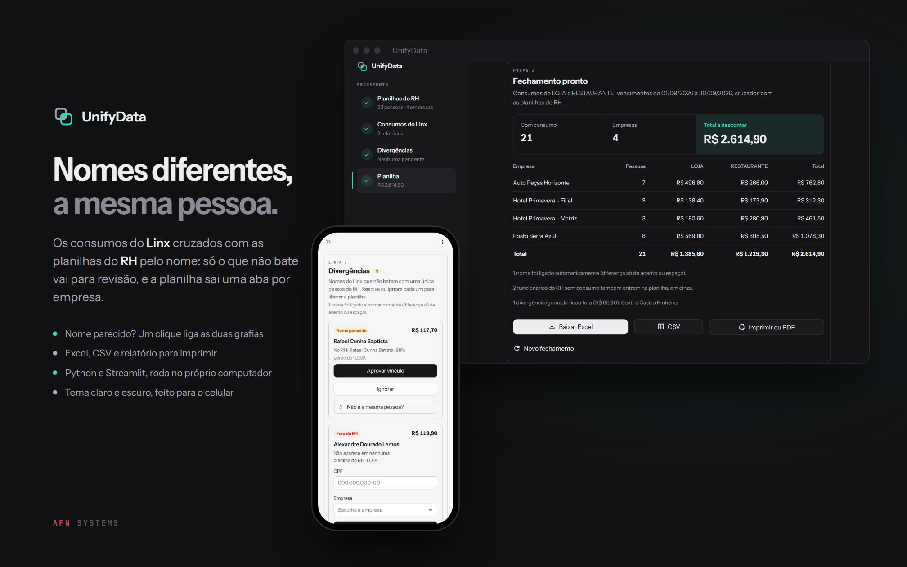
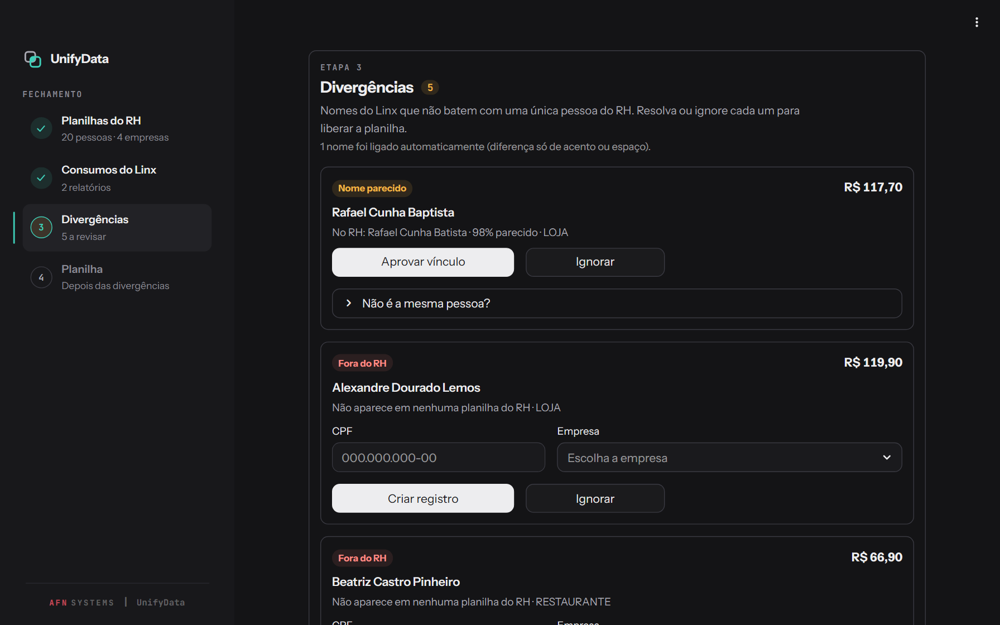
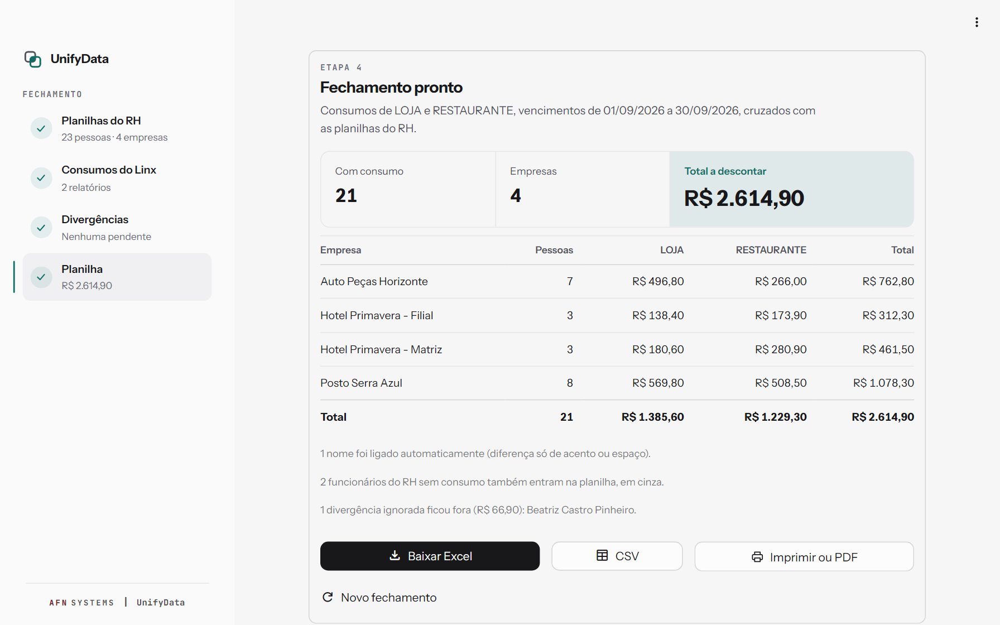
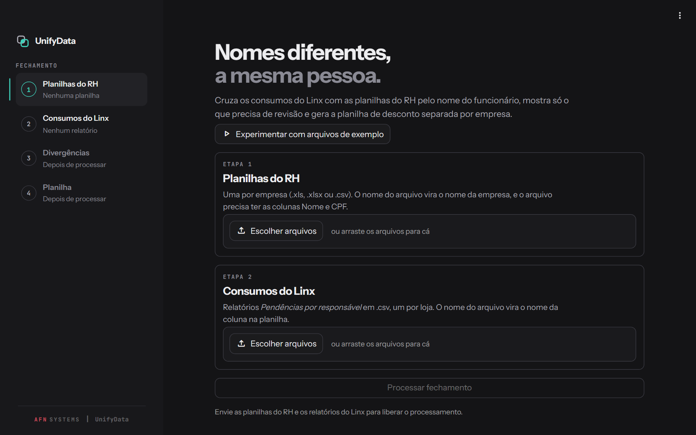
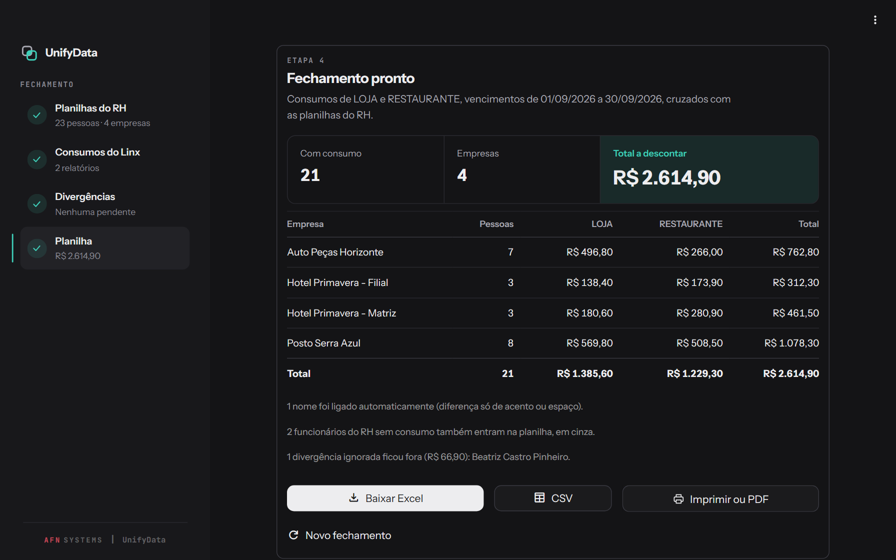
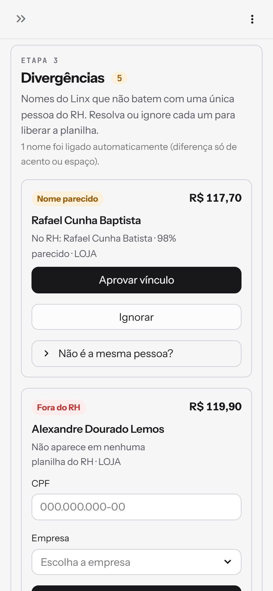
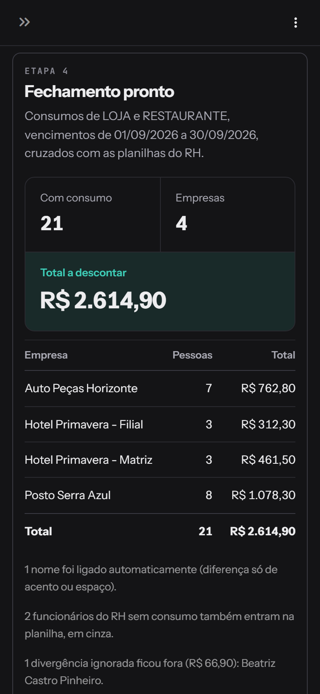
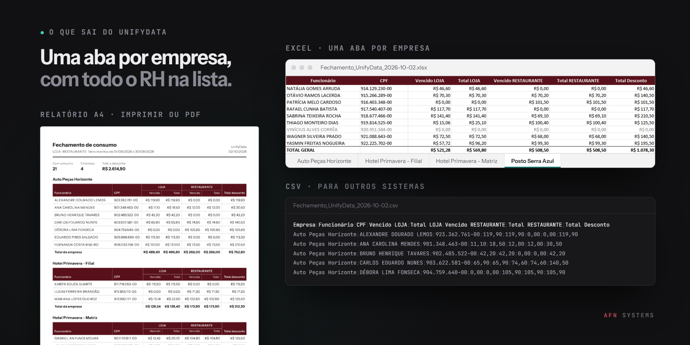

# UnifyData Python



**UnifyData does the month-end closing of employee purchases** for a
group of companies. Employees buy on credit at the group's own stores, and
Linx AutoSystem, the stores' management software, records each purchase.
At the end of the month someone has to turn those Linx reports into a
payroll deduction sheet for each company. When Linx and the HR
spreadsheets share no common code, the only thing linking them is the
**name**, and names are written in many ways: *BAPTISTA* in one place,
*BATISTA* in the other; *DEBORA* without the accent; a surname cut short.

**UnifyData matches people by name** and asks a person only about what
cannot be decided alone. Names that differ only by accent, case or spaces
are linked automatically; similar names, repeated names and people who
are not in HR become review cards; the result is the deduction sheet, one
sheet per company.

Built with Python and Streamlit, it runs on your own computer. The
interface is in Portuguese.

**Try it** in two commands (below), then click **Experimentar com
arquivos de exemplo** (Try with sample files): made-up files, nothing is
saved. Or try the [web version](https://alyssom-fernandes.github.io/UnifyData-Web/?demo=1)
right now, in the browser, with nothing to install.

[](https://github.com/alyssom-fernandes/UnifyData-Python/actions/workflows/testes.yml)


This README is also available in [Portuguese](README.pt-BR.md).

## In 30 seconds

1. Install and start it (a minute or two the first time):

   ```bash
   pip install -r requirements.txt
   streamlit run unifydata.py
   ```

   On Windows, `Iniciar_UnifyData.bat` does both with a double click.
2. Click **Experimentar com arquivos de exemplo**. Three HR spreadsheets
   and two Linx reports load. *DEBORA* (Linx) is linked to *DÉBORA* (HR)
   on its own, and five cards show up in the *Divergências*
   (discrepancies) step: one similar name (*Rafael Cunha Baptista* in
   Linx, *Batista* in HR, 98% alike) and four people who are in no HR
   spreadsheet.
3. Approve the link, type a CPF (the Brazilian taxpayer ID) and a
   company, or ignore. When no card is
   left, the closing is ready, with **Baixar Excel**, **CSV** and
   **Imprimir ou PDF** (Print or PDF).

## Screenshots

Taken from the sample files.

| Name review, dark theme | Closing ready, light theme |
|---|---|
|  |  |
| **Start screen, dark theme** | **Closing ready, dark theme** |
|  |  |

| On a phone, light theme | On a phone, dark theme |
|---|---|
|  |  |

## What comes out



- **Excel**: one sheet per company with **every employee in HR**; those
  with no consumption this month show up in gray, so the sheet doubles as
  the payroll list. Frozen header, currency format, formatted CPF, a
  totals row and sheet names that are always valid in Excel. Each sheet
  is set to print on A4, fitting the page width.
- **CSV**: `;` separators and decimal commas, the way Excel in Portuguese
  opens it, with a company column.
- **Report** to print or save as PDF: A4, landscape when there are three
  stores or more, each company kept whole on a page when it fits, and
  numbered pages. Ignored people are listed at the bottom, with the
  amount.

## What it does

### Reading

- **HR spreadsheets**: one per company, .xls, .xlsx or .csv, with name
  and CPF columns, wherever the header row is. The file name becomes the
  company name; a workbook with several sheets becomes *Company - Sheet*,
  unless the sheet has Excel's default name (Plan1, Planilha1...).
- **Linx reports**: the *Pendências por responsável* (pending by person)
  CSV, one per store. Two values per person and store, *overdue* and
  *total*, and the due-date period.

### Matching, from safest to most careful

1. **Same name once accents, case and spaces are removed**, and only one
   person in HR with it: linked automatically (the screen says how many).
2. **Similar name** (85% or more with `token_sort_ratio`, which also
   catches swapped word order): a card suggests the link. Approve it, or
   say it is someone else by typing their CPF; the card shows whose CPF
   it is before you confirm.
3. **Name repeated in HR** (namesakes, or one person in two
   spreadsheets): the card asks which row to charge, so nobody is charged
   twice. It is never chosen automatically.
4. **Not in HR**: type the CPF. If it belongs to someone in HR, the
   consumption goes to that person; if not, a record is created in the
   chosen company (an existing one or a new one). Or ignore it.

Each card can be ignored; ignored people and their amounts are listed on
the result and in the report.

### Phone and themes

- Light and dark themes, following the system, switchable from the ⋮
  menu. The custom parts follow the theme even when it changes without a
  reload.
- A sidebar with the four steps and their status, and the AFN Systems
  signature; on a phone, cards and buttons take the full width.

## Privacy and security

- **Runs on your computer, for your computer only.** The server listens
  on `localhost`, so other machines on the network cannot open it. The
  files stay in the memory of your Streamlit session and are not written
  anywhere; closing the session discards them. Streamlit's usage
  statistics are turned off.
- **The sample mode** loads the made-up files from `exemplos/`; it does
  not touch anything else.
- **Text from the files is never trusted**: names and file names are escaped
  before they become HTML, and CSV cells that start with `=`, `+`, `-` or
  `@` get a leading apostrophe, so a spreadsheet cannot run a formula
  hidden in a name.

## How it is built

| Part | Technology |
|---|---|
| Interface | Streamlit 1.57, with its theme config and a little CSS |
| Data | pandas for reading and consolidating; xlrd for legacy .xls |
| Names | thefuzz (`token_sort_ratio`) for similarity |
| Writing | openpyxl for the .xlsx; the CSV and the report are made by the app |
| Fonts | Instrument Sans for the interface; JetBrains Mono for labels and the signature |
| Tests | `unittest`, on every push (GitHub Actions) |

Some decisions behind it:

- **The rules live apart from the screen.** `nucleo.py` has pure
  functions for reading, matching, consolidating and writing the Excel
  and the CSV; `unifydata.py` only draws the screen and calls them. The
  tests run the rules against the same sample files, without Streamlit.
- **Automatic only when the match is unambiguous.** A link is made alone
  only when the name is the same once accents, case and spaces are
  removed, and HR has a single spelling of it; everything else waits for
  a click.
- **Namesakes are protected.** When a name appears more than once in HR,
  the consumption goes to the chosen row only, and the other rows stay
  at zero. Consumption that a CPF has already tied to one person stays
  with that person, whatever is chosen later for the name.
- **Clicks are safe.** Every action is a callback that runs before the
  next redraw, so a double click on a button that already did its job
  does nothing.

## Known limitations

- It depends on the layout of the Linx *Pendências por responsável* CSV.
- Matching by name needs a person to confirm the doubtful cases; that is
  by design.
- Nothing is kept between closings: the HR spreadsheets are read again
  each month. (The [web version](https://github.com/alyssom-fernandes/UnifyData-Web)
  keeps a register and matches by employee code instead.)
- It needs Python on the computer; there is no hosted version.
- The fonts come from Google Fonts; without internet, the system fonts are
  used.
- Some parts belong to Streamlit itself: the ⋮ menu is in English, and its
  *Print* prints the whole page (the **Imprimir ou PDF** button prints
  only the report).
- Tested in Chrome and Edge, on a computer and at phone width. The
  interface is in Portuguese only.

## Running it

Python 3.10 or newer (the tests run on 3.12 in CI; the app was used
with 3.14):

```bash
pip install -r requirements.txt
streamlit run unifydata.py
```

The app opens at `http://localhost:8501`; `http://localhost:8501/?demo=1`
opens straight into the sample files. On Windows, `Iniciar_UnifyData.bat`
installs what is missing on the first run, writes an empty Streamlit
credentials file (so Streamlit does not ask for an email) and opens the
app.

To run the tests:

```bash
python -m unittest discover -s tests
```

## Project structure

```
unifydata.py            the Streamlit app: steps, review cards, result and exports
nucleo.py               pure rules: reading, name matching, consolidation, Excel, CSV
requirements.txt        dependencies
Iniciar_UnifyData.bat   Windows launcher
.streamlit/config.toml  light and dark themes, fonts, toolbar, telemetry off
assets/favicon.png      the UnifyData mark
tests/                  tests for the rules, with the sample files
exemplos/               made-up files in the Linx and HR formats
.github/workflows/      runs the tests on every push
docs/telas/             images for this README and the social preview (og.png)
```

## Compared with the web version

| | UnifyData Web | UnifyData Python |
|---|---|---|
| **Runs** | In the browser, nothing to install | On the computer, with Python |
| **Inputs** | Linx accounts receivable PDF, HR spreadsheets, Linx CSVs | HR spreadsheets and Linx CSVs |
| **Matching** | By employee code (exact) | By name (fuzzy, with review) |
| **Namesakes** | Not an issue, the code tells them apart | A card asks which row to charge |
| **Employee data** | A register saved in the browser | HR spreadsheets read every month |
| **Excel** | People with consumption; totals as `SUM` formulas | Every HR employee (no consumption in gray) |
| **Best for** | Linx and HR share the employee code | Systems with no common code |

## License

[MIT](LICENSE). Made by [Alyssom Fernandes](https://github.com/alyssom-fernandes), AFN Systems.
